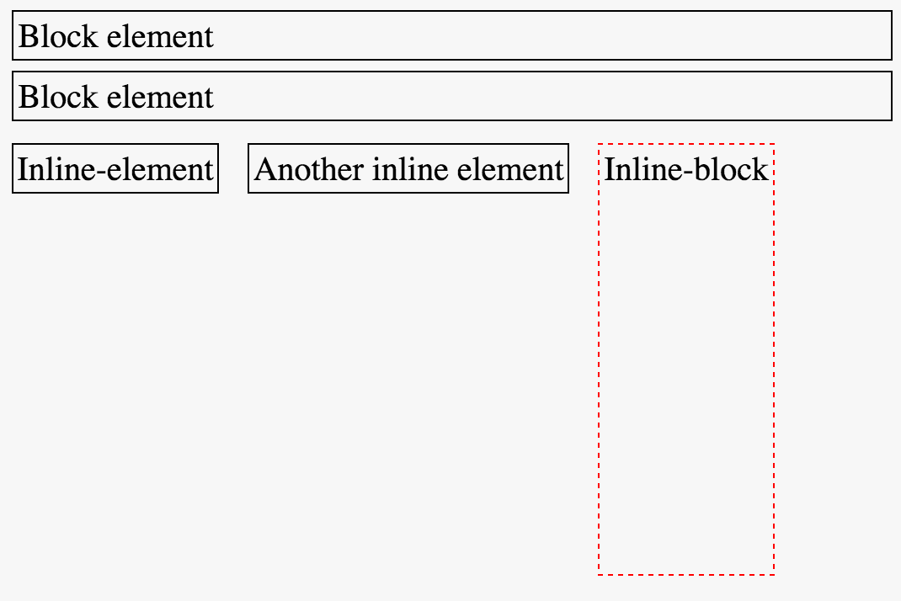

# Module 7: Introduction to Cascading Style Sheets

## Overview
In this module, you will learn how to manipulate the rendering of HTML elements by writing Cascading Style Sheets (CSS). CSS syntax allows you to specify _how_ you want a web browser to represent elements on your webpage.

<!-- START doctoc generated TOC please keep comment here to allow auto update -->
<!-- DON'T EDIT THIS SECTION, INSTEAD RE-RUN doctoc TO UPDATE -->
**Contents**

- [Resources](#resources)
- [Writing CSS](#writing-css)
- [CSS Syntax](#css-syntax)
- [Selectors](#selectors)
- [The Cascade](#the-cascade)
- [Arranging elements](#arranging-elements)
  - [Display](#display)
  - [Position](#position)
- [The Box-Model](#the-box-model)
- [CSS Units](#css-units)
  - [Absolute Units](#absolute-units)
  - [Relative Units](#relative-units)

<!-- END doctoc generated TOC please keep comment here to allow auto update -->

## Resources
- [CSS Selector Reference](http://www.w3schools.com/cssref/css_selectors.asp)
- [CSS Properties Reference](http://www.w3schools.com/cssref/default.asp)
- [CSS Selector Specificity](https://www.smashingmagazine.com/2007/07/css-specificity-things-you-should-know/)
- [CSS Units Reference](http://www.w3schools.com/cssref/css_units.asp)
- [REM v.s. EM Unit Sizing](https://zellwk.com/blog/rem-vs-em/)
- [Materialize Framework](http://materializecss.com/)
- [Font Awesome icons](https://fortawesome.github.io/Font-Awesome/)

## Writing CSS
There are three different options for incorporating your CSS styles into your webpage. The most preferable and consistent approach is to write all of your CSS code in a separate file, and load that file into your `index.html` file in the `<head>` section of your page:

```html
<!DOCTYPE html>
<html>
  <head>
  <!-- Read in a local CSS file -->
  <link href="css/main.css" rel="stylesheet" type="text/css" />
  </head>
</html>
```

Alternatively, you may see a `<style>` tag _inside of_ the `<head>` section of a webpage. This is _not recommended_ as it makes your `index.html` file more difficult to read, and doesn't take advantage of a simple way to compartmentalize your code:

```html
<!DOCTYPE html>
<html>
  <head>
  <!-- Write styles -->
  <style>
    /* CSS styles get written in here */
  </style>
  </head>
</html>
```

Finally, you may see CSS styles written _in-line_ with an individual HTML element. Again, this is _not recommended_, as it clutters your HTML code, but you'll see this quite frequently. You can assign a `style` attribute inside an HTML tag to apply styles to it:

```html
<!-- Inline style -->
<p style="font-size:28px;">This text would be 28px in size</p>
```

## CSS Syntax
In your CSS file, you'll apply a variety of styles to selected elements (more on this below). Following each `selector`, you will write a number of `property:value;` pairs _inside of_ a set of curly braces (`{}`). In your `property:value;` pair, the **property** is the style you wish to manipulate (i.e., color) and the `value` is the specific value you wish to apply (i.e., blue) to that property. Here is some css pseudo-code:

```css
selector1 {
  property:value;
  property-2:value2;
}

selector2 {
  property:value;
  property2:value2;
}
```

## Selectors
In order to apply a style to an element, you must **select** that element on the page. This is a common task in web-development, and multiple libraries (`d3` and `jquery` included), follow these conventions.  Here are some basic ways in which you can select elements (way [more](http://www.w3schools.com/cssref/css_selectors.asp)):

| Syntax  | Example | Selection |
| ------------- | ------------- | ------------- |
| `#element-id` | `#my-div` | Select the element with id `my-div` |
| `.class-name` | `.large` | Selects **all** elements with class `large`|
| `element-type`| `p` | Selects **all** paragraph (`<p>`) elements |
| `:hover`| `a:hover` | Applies styles to **all** links when they are hovered over |
| `element-type element-type`| `section p` | Selects **all** `<p>` elements **inside of** `<section>` elements |
| `element-type.class-name`| `p.large` | Selects **all** `<p>` elements with class `large` |

## The Cascade
As you might have imagined, CSS styles are applied in a _cascading_ fashion. Because HTML elements are arranged in a tree structure, styles are applied to _child_ elements. For example:

```html
<div id="container">
    <div id="sub-div"> <!-- Has own styles + #container styles -->
        <p id="block"> <!-- Own styles + #sub-div + #container -->
            <text>Text1</text> <!--  styles + #block + #sub-div + #container -->
            <text>Text2</text>
            <text>Text3</text>
        </p>
    </div>
</div>
```
However, there are a few more important pieces of logic that you need to understand in terms of how CSS styles are applied:

1. CSS styles are _additive_: if multiple rules apply to the same element, the browser will combine all of the style properties when rendering the content.
2. _Order_ matters: If a later rule selects an element and sets the same _property_ to a different _value_, the later rule's setting overrides.
3. _Specificity_ matters: The specificity with which elements are selected may override the order in which they are applied. More specific selection (i.e., `id` > `class` > `type`) will take precedence (more on that [here](https://www.smashingmagazine.com/2007/07/css-specificity-things-you-should-know/)).


## Arranging elements
Elements naturally arrange themselves on the page (from top to bottom, left to right) based on their size.

### Display
Each HTML element has a default `display` property that indicates how it will horizontally share space with other elements:

>**Block level elements**: take up 100% of the width, and will not be in the same horizontal alignment as other elements.  Examples include `<div>`, `<h1>` - `<h6>`, and `<form>`.

>**Inline level elements**: only take up as much width as their contents, and will share a horizontal position with other elements if they fit within the width of the page.  Examples include `<svg>`, `<a>`, and `<span>`.

>**Inline-block elements**: permit multiple elements to align horizontally (like inline), while allowing you to set a desired width and height (like block).

**Note**: You can change the default `display` property of any element to assign it the characteristics you desire.  However, these defaults are specified for a reason -- rather than change the `display` property, you may want to choose another type of element.

Here is an example of how block, inline, and inline-block elements arrange themselves:



As you can see, the `block` level elements take up an entire row, regardless of the size of their contents. The `inline` and `inline-block` elements only take up as much horizontal space as is necessary. Unlike the `inline` element, the height of the `inline-block` is able to be set using CSS.

### Position
In addition to _how_ you wish elements to be displayed, you can also manipulate their **position**. The `position` property allows you to adjust the layout beyond the natural flow of elements on the page. Depending on the `position` property, you can shift the location of elements using the `top`, `bottom`, `left`, and `right` properties. There are four different _values_ that the **position** property can take on:

>**Static**: By default, elements are positioned statically. This is their natural layout, and elements _will not_ be shifted by the `top`, `bottom`, `left`, or `right` properties.

>**Relative**: Allows you to shift the element _relative_ to it's natural position on the page. This enables you to move the element using the `top`, `bottom`, `left`, and `right` properties.

>**Fixed**: The _fixed_ position allows you place an element in a consistent location within a browser window. For example, if you wanted a link to _always_ be 50px from the bottom, you could set the properties: `position:fixed;` and `bottom:50px;`.

>**Absolute**: The _absolute_ position allows you to place an element a specific number of pixels from it's parent element.  

To practice manipulating the position of elements, head over to [exercise-1](exercise-1).

## The Box-Model
The amount of space taken up by each element is best explained by the [box-model](http://www.w3schools.com/css/css_boxmodel.asp).  Think of each HTML element as some content in a box.  The amount of space occupied by that box depends on:

- The amount of space between the content and the outsize of the box (`padding`)
- The thickness of the box (`border`)
- The desired distance between the box and other boxes (`margin`)

Manipulating these properties allows you to specify how your content should be arranged on the page:


## CSS Units
There are a variety of units available to you for declaring the size of elements, and the amount of space between them. Units can be specified either in **absolute** or **relative** values, each of which has some advantages.

### Absolute Units
If you want to declare the size of an element _regardless_ of it's placement on the page, you'll use absolute units. There are multiple absolute units you can use, though the most common is to use pixels(`px`) (table adapted from [w3schools](http://www.w3schools.com/cssref/css_units.asp)):

| Unit | Description     |
| :------------- | :------------- |
| px      | Pixel: 1/96 of an inch|
| cm      | 1 Centimeter|
| mm      | Millimeter |
| in      | Inch |

Using absolute units in CSS is fairly straightforward -- simply specify the amount of space you want for a particular property:

```css
p {
  font-size: 20px;
  margin-bottom:10px;
  padding-top:5px;
}
```

### Relative Units
Using relative units can be a bit more complex, but allows you to make more dynamic and flexible pages (more on this in the next module). We'll focus on 3 types of relative units in this section:

- Relative to the **current** element's font-size (`em`)
- Relative to the **root** element's font-size (`rem`)
- Relative to the **parent** element's font-size _or_ dimensions (`%`). Useful for taking up a proportional amount of space, but `em` is preferable for `font-size`.

To begin, you should know that your browser has a default size for the root element, which is typically `16px`. While it's possible to alter this, it isn't suggested. These could be applied as follows (inline-style used for readability):

```html
<!-- Root font-size is 16px -->
<body>
  <!-- Section font-size will be 32px -->
  <section style="font-size:2rem;">
    <!-- Inherets font-size from section: 32px; -->
    <p>32px</p>

    <!-- Font-size will be 1/2 of parent's font-size: 16px -->
    <p style="font-size:.5em;">16px</p>

    <!-- Font-size will be 1/2 of root's font-size: 8px -->
    <p style="font-size:.5rem">8px</p>
  </section>
</body>
```

Note, relative sizing is not just for font-size: it is also quite useful for setting the margin or padding of an element:

```css
/* Set styles of paragraphs using relative sizings */
p {
  margin:.5rem;
  padding:.25rem;
}
```

This will help keep consistent spacing across devices and screen sizes.
