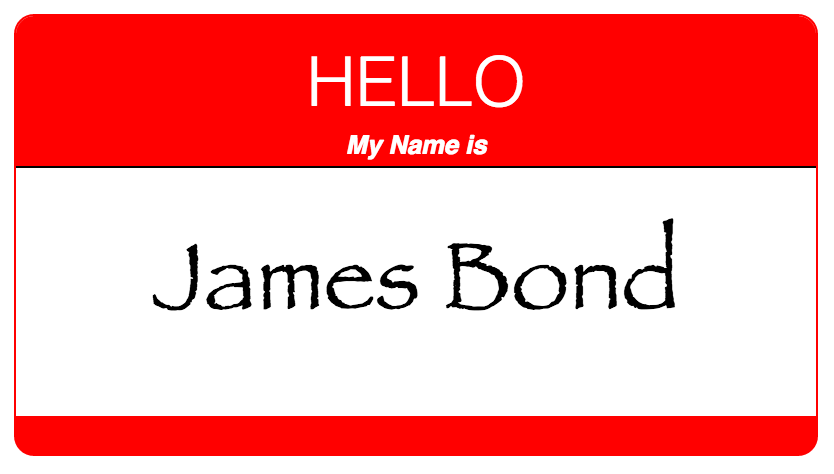

## Exercise 2: Positioning

In this exercise, you'll experiment with the `position` attribute to place labels on top of an image. The final product will look like this:

As described in [module-4](https://github.com/info343c-a16/m4-git-intro), start by forking and cloning this repository. Then, you should do the following:

- Add an HTML element for each label (I suggest `
` elements, but you can also try ``s)
- Add thoughtful classnames that allow you to describe the positions of each element
- Assign a `position` property to each label that allows you to manipulate it's location relative to it's parent (don't be tricked: it's _not_ relative)
- Use the `top`, `left`, `bottom`, and `right` properties to position elements in their desired location
- You may want to use the `text-align` and `width` properties to place the elements in the **middle**

See the `complete` branch for answers.
